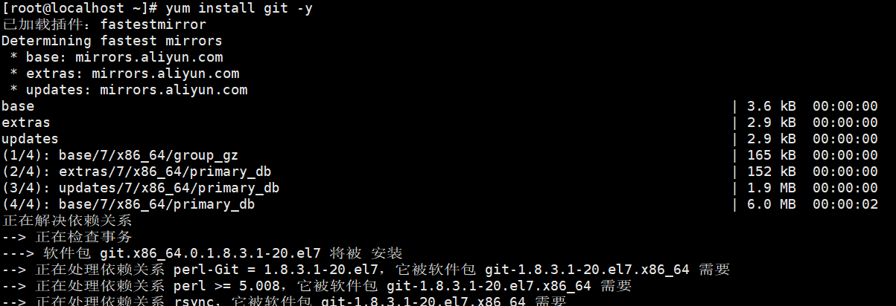
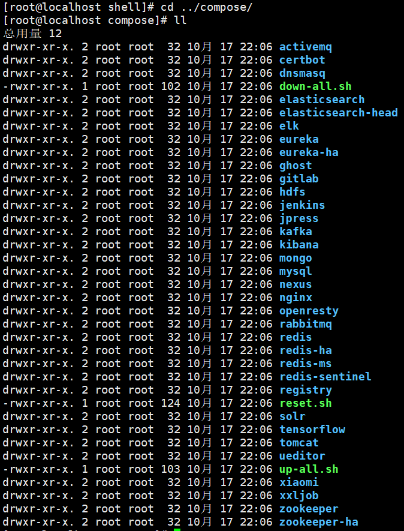
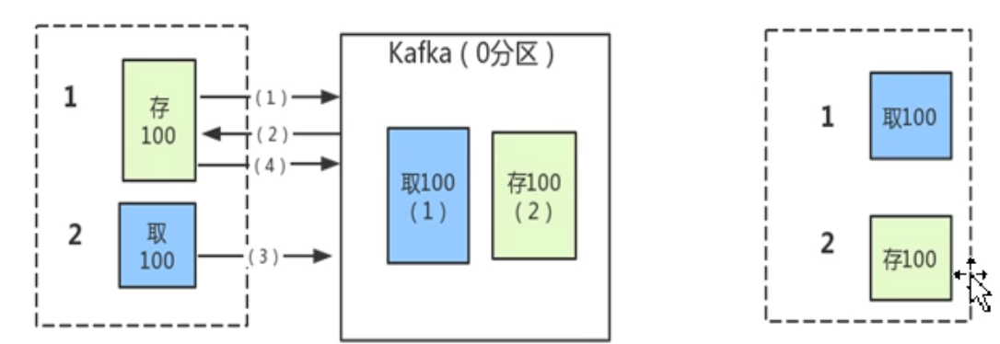

# docker

docker 服务器测试环境搭建使用的整个目录结构及可能使用到的脚本文件

本文档使用教程绝大部分基于java spring boot，除非有特殊标识说明基于其他的框架或语言

[关于多个docker-compose间通讯问题](https://blog.csdn.net/tang05709/article/details/88410471)

## 快速使用

> 安装git：yum install git -y
>
> 

1：git clone --depth 1 https://github.com/zywayh/docker.git

> 码云地址： https://gitee.com/ywyh/docker 
>
> 私有地址：http://git.healthtoo.cn/ywyh/docker


2：cd ./docker/shell


3：执行脚本 ./install-docker.sh  安装docker和docker-compose


4：进入compose，找到想使用的服务，进入文件夹



5：执行命令 docker-compose up -d 启动服务   docker-compose down 关闭服务

> 如在下载镜像中出现 `Get https://registry-1.docker.io/v2/: net/http: TLS handshake timeout` 或 `ERROR: Get https://registry-1.docker.io/v2/library/nginx/manifests/latest: net/http: TLS handshake timeout` 错误，重试或使用docker pull 镜像名先拉取镜像（如无法解决请自行百度）


## docker 命令说明

* 启动创建好的容器：docker start 启动的容器名称
* 停止启动的容器：docker stop 启动的容器名称
* 重启停止的或启动中容器：docker restart 启动的容器名称
* 查看容器日志：docker logs -f --tail 100 启动的容器名称
* 进入容器bash命令行：docker exec -ti 启动的容器名称 bash

## docker-compose 命令说明

> 在运行命令的目录下需存在docker-compose.yml文件

* 启动编排好的容器：docker-compose up -d
* 停止并删除编排好的容器：docker-compose down 

## 目录结构

目录|简介
---|---
build|镜像编译文件目录
compose|常用的docker-compose.yml
conf|存放所有镜像所需的配置文件映射
data|存放所有镜像产生的数据映射
html|存放前端代码映射
project|存放项目的目录映射
shell|封装的脚本(可执行)文件

### build目录介绍

目录|简介
---|---
grails|grails运行镜像编译文件
sentinel|redis-sentinel运行镜像编译文件
solr|solr运行镜像编译文件(内置了ik分词器)

### compose目录介绍

目录|简介
---|---
activemq|
certbot|
elk|
eureka|
eureka-ha|
jenkins|
kafka|使用kafka是请启动zk，并将docker-compose.yml中
mysql|
nginx|
openresty|需配置docker-compose links：redis链接才可以使用redis
redis|
redis-sentinel|
registry|
solr|ik分词器请自行配置
zookeeper|
zookeeper-ha|

### shell目录介绍

目录|简介
---|---
certbot.sh| ssl证书生成脚本                                   
crontab.txt|定时任务demo
install-docker.sh|系统初始化安装docker
install-alioss.sh|安装阿里oss映射,可作为存储硬盘使用 [官方文档](https://help.aliyun.com/document_detail/32196.html?spm=a2c4g.11186623.6.746.19653090nsDPq0)
 mongodump.sh      | docker镜像mongo数据库备份数据                     
 mysqldump.sh      | docker镜像mysql数据库备份数据                     
 rc.sh             | 开机启动脚本,添加到开机任务中,文件中的shell可启动 
 vue.sh            | vue编译脚本                                       
 webhook.sh        | 钉钉的webhook喝水提醒通知脚本                     

# 使用介绍

## 花生壳

#### centos 7.x

> [官方文档](http://service.oray.com/question/4287.html )，[下载地址](https://hsk.oray.com/download/)
>
> 下载时，请注意官网的最新版本号

* wget http://download.oray.com/peanuthull/linux/phddns-3.0.2.x86_64.rpm

  

* rpm -ivh phddns-3.0.2.x86_64.rpm 

  > 安装后会出现sn码和默认密码，在网页端进行登录http://b.oray.com

  

* 登录后需要激活，请使用app登录自己的花生壳账号进行登录绑定机器，后在页面配置映射地址即可使用

#### win

在官网下载win花生壳软件，打开即可使用

#### Mac

在官网下载win花生壳软件，打开即可使用

## RabbitMQ

### 启动

进入 compose目录下的rabbit文件夹

文件夹下存在docker-compose.yml文件

使用docker-compose up -d后台启动

### RabbitMQ 插件使用

* 启动docker容器后，执行下列语句开启关闭rabbitmq_delayed_message_exchange 

> 开启命令：docker exec rabbit sh -c "rabbitmq-plugins enable rabbitmq_delayed_message_exchange"
>
> 关闭命令：docker exec rabbit sh -c "rabbitmq-plugins disable rabbitmq_delayed_message_exchange"
>
> 查看插件列表：docker exec rabbit sh -c "rabbitmq-plugins list"

#### spring boot使用方法

* pom引入jar包

  ```xml
  <dependency>
  	<groupId>org.springframework.boot</groupId>
  	<artifactId>spring-boot-starter-amqp</artifactId>
  </dependency>
  ```

  

* 代码实现

  * 队列创建

    ```java
    import org.springframework.amqp.core.*;
    import org.springframework.context.annotation.Bean;
    import org.springframework.stereotype.Component;
    
    import java.util.HashMap;
    import java.util.Map;
    
    /**
     * @description:
     * @author: zhuyawei
     * @date: 2019-09-06 13:17
     */
    @Component
    public class RabbitMQConfig {
    
        /**
         * 定义queue名称
         */
        public static final String MQ_QUEUE_NAME = "QU_SHI";
    
        /**
         * 定义exchange
         */
        public static final String MQ_EXCHANGE_NAME = MQ_QUEUE_NAME;
    
        /**
         * 定义queue和exchange绑定使用的routingKey名称
         */
        public static final String MQ_ROUTING_KEY = MQ_EXCHANGE_NAME;
    
        /**
         * 创建消息队列
         * @return
         */
        @Bean
        public static Queue queue() {
            return new Queue(MQ_QUEUE_NAME);
        }
    
        /**
         * 创建自定义类型的exchange
         * 应用于延时消息队列使用，需与queue进行bind
         * @return
         */
        @Bean
        public static CustomExchange exchange() {
            Map<String, Object> arguments = new HashMap<>();
            arguments.put("x-delayed-type", "direct");
            return new CustomExchange(MQ_EXCHANGE_NAME, "x-delayed-message", true, false, arguments);
        }
    
        /**
         * queue和自定义exchange进行绑定
         * @param queue
         * @param exchange
         * @return
         */
        @Bean
        Binding bindingExchangeMessages(Queue queue, CustomExchange exchange) {
            return BindingBuilder.bind(queue).to(exchange).with(MQ_ROUTING_KEY).noargs();
        }
    
    //    /**
    //     * 创建RabbitMQ指定类型的
    //     * @return
    //     */
    //    @Bean
    //    TopicExchange topicExchange() {
    //        return new TopicExchange(MQ_EXCHANGE_NAME);
    //    }
    //
    //    /**
    //     * queue和exchange进行绑定
    //     * 创建普通非延时exchange及绑定，如无特殊需求，在非延时队列并不需要创建exchange
    //     * @param queueMessages
    //     * @param topicExchange
    //     * @return
    //     */
    //    @Bean
    //    Binding bindingExchangeMessages(Queue queueMessages, TopicExchange topicExchange) {
    //        return BindingBuilder.bind(queueMessages).to(topicExchange).with(MQ_ROUTING_KEY);
    //    }
    
    }
    ```

    

  * 生产者及消费者

    ```java
    import com.trend.config.RabbitMQConfig;
    import org.springframework.amqp.core.AmqpTemplate;
    import org.springframework.amqp.core.Message;
    import org.springframework.amqp.core.MessageProperties;
    import org.springframework.amqp.rabbit.annotation.RabbitListener;
    import org.springframework.beans.factory.annotation.Autowired;
    import org.springframework.stereotype.Component;
    
    /**
     * @description: mq 工具类，其中包含生产者及消费者，
     * @author: zhuyawei
     * @date: 2019-09-06 13:19
     */
    @Component
    public class MqUtil {
    
        private static AmqpTemplate rabbitTemplate;
    
        @Autowired
        private void setRabbitTemplate(AmqpTemplate rabbitTemplate){
            MqUtil.rabbitTemplate = rabbitTemplate;
        }
    
        /**
         * 发送消息
         * @param msg   消息体
         */
        public static void send(String msg) {
            send(msg, 0);
        }
    
        /**
         * 发送延时消息
         * @param msg   消息体
         * @param delay 延时时间，如果为空，或者=0，或者小于0不延时
         */
        public static void send(String msg, Integer delay) {
            if(delay <= 0){
                rabbitTemplate.convertAndSend(RabbitMQConfig.MQ_ROUTING_KEY, msg);
            }else{
                MessageProperties properties = new MessageProperties();
                properties.setDelay(delay);
                Message message = new Message(msg.getBytes(), properties);
                rabbitTemplate.send(RabbitMQConfig.MQ_EXCHANGE_NAME, RabbitMQConfig.MQ_ROUTING_KEY, message);
            }
        }
    
        /**
         * 消费消息（处理逻辑请另行定义）
         * @param message
         */
        @RabbitListener(queues = RabbitMQConfig.MQ_QUEUE_NAME)
        private void process(Message message) {
            System.out.println("消息消费：" + new String(message.getBody()));
        }
    }
    
    ```

    

## openresty 简单使用

> 使用时请先链接docker-compose.yml文件中的links，使其能够连通redis进行使用

```js
$.ajax({
	url: "/set",
	data: {key: "",val: "val"},
	dataType: "text",
	success: function(data){
		$('#resText').append(data);
		if(data == "+OK"){
			$('#resText').append("<div>true</div>");
		}else{
			$('#resText').append("<div>false</div>");
		}
	}
});
$.ajax({
	url: "/get",
	data: {key: "t2est"},
	dataType: "text",
	success: function(data){
		$('#resText').append(data);
		var list = data.split("\n")
		if(list.length > 0){
			$('#resText').append("<div>" + list[1] + "</div>");
		}else{
			$('#resText').append("<div>" + 获取失败 + "</div>");
		}
	}
});
```


## 个人博客 Jpress

> 使用注意事项
>
> * 需手动创建数据库，需要时utf8mb4格式
> * 无法评论的问题，需要在 “文章” -> “设置” -> “评论功能”中开启评论 
> * **注意事项：每日删除容器，重新创建启动后，需要配置数据库连接**


## 持续集成工具 jenkins

> linux启动时，因为系统权限问题，无法创建对应的文件，
>
> 使用命令 `sudo chown -R 1000:1000 文件目录` 进行修改目录权限（容器中jenkins user的uid为1000）
>
> 其中下载插件的时间最长，建议下载插件，放到plugin目录下（缺点首次启动时间会延长几倍），启动完成后，今日安装推荐页面点击安装直接就会成功
>
> 使用命令`wget http://file.ywyh.red/jenkins_2.198_plugins.zip`下载插件包，解压到对应目录即可
>
> 构建后执行shell脚本操作，里面包含了初始安装，gitlab，ssh等必要的插件，如需其他请自行下载
>
> > 解决方案：
> >
> > 因本教程使用的为docker容器，容器和宿主机隔离，故无法执行本地脚本，建议使用远端执行脚本
> >
> > 单目前发现一个问题，配置脚本目录也会更新一遍对应仓库的代码，**暂无解决此问题**
>
> “增加构建后操作步骤”，在下拉选项中选择“Send build artifacts over SSH”这个选项，如果没有这个选项，需要装个“Publish Over SSH”的插件，详细配置请自行百度，主要是配置全局配置Publish Over SSH添加远端主机，添加后即可在“增加构建后操作步骤”处选择“Send build artifacts over SSH”添加执行

### 启动

* 进入docker -> compose -> jenkins 目录下
* 使用docker-compose up -d 启动jenkins

### 初始化配置

* 初始密码位置：data/jenkins/secrets/initialAdminPassword

  > data/ 为相对目录，请根据自己映射的宿主机文件目录结构查找

* 输入初始密码，进入配置首页后，输入网址 http://IP地址/pluginManager/advanced配置镜像源

  > 因下载插件慢，解决办法为更换镜像源，所以可以先不安装插件（选择自定义安装，取消所有选择安装的插件，点击下一步），进入jenkins后在 系统管理->管理插件->高级->升级站点更换镜像源，

  站点信息从：https://updates.jenkins.io/update-center.json 改为如下地址【三选一即可】

  http://mirror.xmission.com/jenkins/updates/update-center.json   # 推荐
  http://mirrors.shu.edu.cn/jenkins/updates/current/update-center.json
  https://mirrors.tuna.tsinghua.edu.cn/jenkins/updates/update-center.json

  **更换镜像源后需要重启**

*  进入Jenkins首页：http://IP地址，安装推荐插件（新手推荐）

  > gitlab需要安装插件 gitlab plugin 和 gitlab hook plugin

*  配置实例 Jenkins URL

### 构建项目

> [创建任务教程](https://www.cnblogs.com/reblue520/p/7130914.html) 
>
> [gitlab添加ssh的教程](https://blog.51cto.com/bigboss/2129477)


## kafka

> 硬件对性能的影响以及优先考虑的顺序

* 磁盘：影响最大的事生产者，读写速度，还要考虑分区（多个分区，多个目录，备份问题）
* 网络：生产者，消费者的写入速度和读取速度
* 内存：消费者性能 （0拷贝，生产者消费者全部都在内存操作完成，没有经过磁盘）
* cpu：主要体现在压缩上

### 生产者消费者

#### 生产者

* 实例

  ```
  
  ```

  * bootstrap.servers
    该属性指定broker的地址清单，地址的格式为host:port。清单里不需要包含所有的broker地址，生产者会从给定的broker里查询其他broker的信息。 不过最少提供 2 个 broker 的信息(用逗号分隔，比如: 127.0.0.1:9092,192.168.0.13:9092)，一旦其中一个宕机，生产者仍能连接到集群上。
  * key.serializer
    生产者接口允许使用参数化类型，可以把 Java 对象作为键和值传 broker，但是 broker 希望收到的消息的键和值都是字节数组，所以，必须提供将对 象序列化成字节数组的序列化器。key.serializer 必须设置为实现 org.apache.kafka.common.serialization.Serializer 的接口类，Kafka 的客户端默认提供了 ByteArraySerializer,IntegerSerializer, StringSerializer，也可以实现自定义的序列化器。
  * value.serializer
    同 key.serializer。
    参见代码，模块 kafka-no-spring 下包 hellokafka 中

##### 发送方式

* 发送并忘记（发送没有进行任何的处理，效率最高，会有重试机制，但是可能会丢失消息）

* 同步发送（发送后返回futrue对象，用.get()获取元数据**同步阻塞**，）

* 异步发送（new Callback(){}）

* ACKS机制

  > 消息在集群下的复制机制（银行一般会用5个副本，不同机架，异地灾备）

  * 0：发送消息后就不再管了
  * 1：如果发送给首领，首领挂掉了，就会抛出异常（有重试）**默认**
  * -1：
  * all：必须给所有的分区都写入成功，才会返回成功

##### 顺序保证

> 必须只有一个分区，如果有多个分许是非常困难的



在重试机制下，消息顺序是有可能打乱的，通过此配置可以实现，有顺序保障，严重影响吞吐量，慎用


